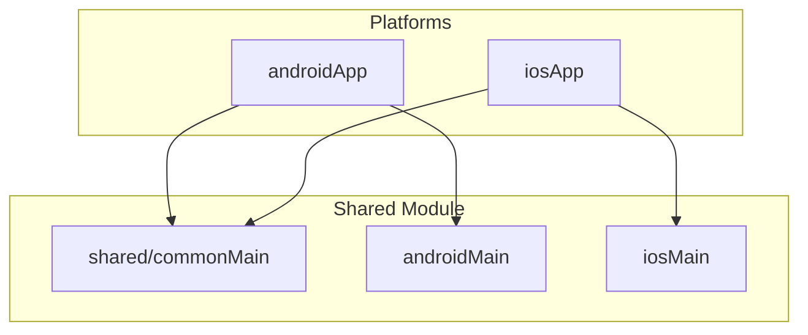

# Kotlin Multiplatform Template

[](https://github.com/nkrebs13/kmp-template/actions/workflows/ci.yml)
[](https://kotlinlang.org)
[](https://www.jetbrains.com/lp/compose-multiplatform/)
[](LICENSE)

A production-ready Kotlin Multiplatform template for iOS and Android apps with Compose Multiplatform.

## Quick Start

```bash
git clone https://github.com/nkrebs13/kmp-template.git my-app
cd my-app
./setup.sh
```

Follow the prompts to customize your project name and package.

## Requirements

| Tool | Version | Notes |
|------|---------|-------|
| JDK | 17+ | Required for Gradle 9.x |
| Android Studio | Latest | With KMP plugin |
| Xcode | 15.0+ | macOS only, for iOS builds |
| macOS | Required | iOS development requires macOS |

## Architecture



## Project Structure

```
template/
├── androidApp/          # Android application module
├── iosApp/              # iOS Xcode project
├── shared/              # KMP shared code
│   ├── commonMain/      # Cross-platform code
│   ├── androidMain/     # Android-specific implementations
│   └── iosMain/         # iOS-specific implementations
├── baselineprofile/     # Android performance optimization
├── gradle/              # Build configuration & version catalog
├── docs/                # Documentation
└── setup.sh             # Template generation script
```

## Included Dependencies

| Category | Library | Version |
|----------|---------|---------|
| **Language** | Kotlin | 2.3.0 |
| **UI** | Compose Multiplatform | 1.10.0 |
| **Build** | Android Gradle Plugin | 9.0.0 |
| **Build** | Gradle | 9.3.0 |
| **Networking** | Ktor | 3.3.0 |
| **DI** | Koin | 4.1.1 |
| **Serialization** | Kotlinx Serialization | 1.9.0 |
| **Images** | Coil | 3.3.0 |
| **Storage** | Room | 2.7.2 |
| **Logging** | Kermit | 2.0.7 |

See [`gradle/libs.versions.toml`](gradle/libs.versions.toml) for the complete list of 100+ dependencies.

## Build Commands

```bash
# Android
./gradlew :androidApp:assembleDebug
./gradlew :androidApp:assembleRelease

# iOS Framework
./gradlew :shared:linkDebugFrameworkIosSimulatorArm64
./gradlew :shared:linkReleaseFrameworkIosArm64

# Testing
./gradlew testDebugUnitTest

# Code Quality
./gradlew spotlessApply    # Format code
./gradlew detekt           # Static analysis
```

## Documentation

- **[Getting Started](docs/README_TEMPLATE.md)** - Guide for generated projects
- **[Configuration](docs/CONFIGURATION.md)** - Customization options
- **[Template Development](docs/TEMPLATE_DEVELOPMENT.md)** - Maintainer guide
- **[Contributing](CONTRIBUTING.md)** - How to contribute
- **[Changelog](CHANGELOG.md)** - Version history

## Contributing

Contributions are welcome! Please read our [Contributing Guide](CONTRIBUTING.md) and [Code of Conduct](CODE_OF_CONDUCT.md) before submitting a PR.

## License

This project is licensed under the MIT License - see the [LICENSE](LICENSE) file for details.

---

**Template Version:** 2.3.0 | **Kotlin:** 2.3.0 | **Compose:** 1.10.0 | **AGP:** 9.0.0 | **Gradle:** 9.3.0
