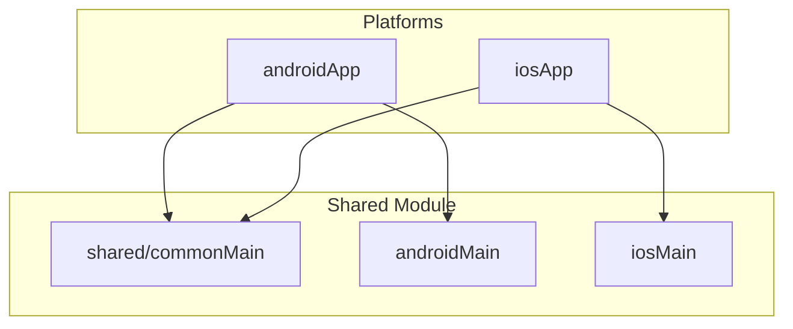

# Kotlin Multiplatform Template

[](https://kotlinlang.org)
[](https://www.jetbrains.com/lp/compose-multiplatform/)
[](LICENSE)

A production-ready Kotlin Multiplatform template for iOS and Android apps with Compose Multiplatform.

## Quick Start

### Option 1: Manual Setup

```bash
git clone https://github.com/nkrebs13/kmp-template.git my-app
cd my-app
./setup.sh
```

Follow the prompts to customize your project name and package.

**Available flags:**
- `--with-mcp` - Keep the MCP server directory for AI-assisted project management
- `--dry-run` - Preview changes without modifying files
- `--help` - Show help message

### Option 2: MCP Tool (AI-Assisted)

If you're using Claude Code, you can generate projects using the MCP tool:

1. Add the server to your Claude Code MCP configuration:
   ```json
   {
     "mcpServers": {
       "kmp-template": {
         "command": "node",
         "args": ["/path/to/template/mcp/index.js"]
       }
     }
   }
   ```

2. Ask Claude to generate a project:
   ```
   Generate a new KMP project called "WeatherApp" with package "com.example.weather" in ~/Projects/WeatherApp
   ```

See [`mcp/README.md`](mcp/README.md) for detailed MCP tool documentation.

## Requirements

| Tool | Version | Notes |
|------|---------|-------|
| JDK | 17+ | Required for Gradle 9.x |
| Android Studio | Latest | With KMP plugin |
| Xcode | 15.0+ | macOS only, for iOS builds |
| macOS | 14.0+ (Sonoma) | Required for iOS development |
| Node.js | 18.0+ | Only if using MCP server |

### iOS Development Requirements

iOS builds require macOS with Xcode. The template targets:
- iOS 15.0+ deployment target
- Xcode 15.0+ (required for Swift 5.9+)
- Apple Silicon (arm64) or Intel (x64) simulators

## Generation Methods Comparison

| Feature | setup.sh | MCP Tool |
|---------|----------|----------|
| Interactive prompts | Yes | No (parameters) |
| Dry-run preview | Yes | No |
| Keep MCP directory | `--with-mcp` flag | Always removed |
| Post-generation validation | Automatic | Automatic |
| Git initialization | Automatic | Automatic |
| IDE integration | N/A | Claude Code |
| Reserved prefix validation | Yes | Yes |
| iOS bundle ID customization | Yes | Yes |

## Architecture



## Project Structure

```
template/
├── androidApp/          # Android application module
├── iosApp/              # iOS Xcode project
├── shared/              # KMP shared code
│   ├── commonMain/      # Cross-platform code
│   ├── androidMain/     # Android-specific implementations
│   └── iosMain/         # iOS-specific implementations
├── baselineprofile/     # Android performance optimization
├── gradle/              # Build configuration & version catalog
├── mcp/                 # MCP server for AI-assisted generation
├── scripts/             # Utility scripts
│   └── validate.sh      # Template reference validation
├── docs/                # Documentation
└── setup.sh             # Template generation script
```

## Included Dependencies

| Category | Library | Version |
|----------|---------|---------|
| **Language** | Kotlin | 2.3.0 |
| **UI** | Compose Multiplatform | 1.10.0 |
| **Build** | Android Gradle Plugin | 9.0.0 |
| **Build** | Gradle | 9.3.0 |
| **Async** | Kotlinx Coroutines | 1.10.2 |
| **Serialization** | Kotlinx Serialization | 1.10.0 |
| **Navigation** | Jetpack Compose Navigation | 2.9.0 |
| **DateTime** | Kotlinx Datetime | 0.6.2 |
| **Code Quality** | Detekt + Spotless | Latest |

This template includes only essential dependencies to keep your project lean. The version catalog also includes commented-out entries for commonly-needed libraries (see the [Dogfooding Notes](#dogfooding-notes--production-patterns) section below). Uncomment what you need in [libs.versions.toml](gradle/libs.versions.toml).

## Build Commands

```bash
# Android
./gradlew :androidApp:assembleDebug
./gradlew :androidApp:assembleRelease

# iOS Framework
./gradlew :shared:linkDebugFrameworkIosSimulatorArm64
./gradlew :shared:linkReleaseFrameworkIosArm64

# Testing
./gradlew testDebugUnitTest

# Code Quality
./gradlew spotlessApply    # Format code
./gradlew detekt           # Static analysis

# Validation (for template development)
./scripts/validate.sh      # Check for template references
```

## MCP Tool

The template includes an MCP (Model Context Protocol) server that enables AI assistants like Claude Code to generate and validate projects programmatically.

### Available Tools

| Tool | Description |
|------|-------------|
| `generate` | Create a new KMP project from the template |
| `validate` | Check a project for remaining template references |
| `list_dependencies` | List all template dependencies with versions |

### Setup

```bash
cd mcp
npm install
```

See [`mcp/README.md`](mcp/README.md) for complete documentation.

---

## Dogfooding Notes — Production Patterns

> These notes come from building [LinkLocker](https://github.com/nkrebs13/LinkLocker) (a full-featured "Read It Later" Android app) using this template as a starting point. They document patterns, architecture decisions, and library choices that proved valuable in production.

### 1. Feature-Modular Gradle Structure

The monolithic `androidApp` module becomes unwieldy quickly. After a few screens, consider refactoring into a multi-module structure:

```
app/                    # Application shell — MainActivity, nav graph, DI root
core/                   # Shared foundation — theme, design system, result types
data/                   # Data layer — Room DB, API client, repositories, sync
feature/
  auth/                 # Auth screen + ViewModel
  queue/                # Queue list + hero card
  reader/               # Article reader + settings
  feeds/                # Feed list + detail
  search/               # Search screen
  highlights/           # Highlights list
  settings/             # Settings screen
```

**Dependency flow:** `app -> feature/* -> data -> core`

Key benefits:
- Build times improve as Gradle can parallelize module compilation
- Enforces clean architecture — feature modules cannot depend on each other
- Each feature module has its own Koin DI module with `viewModel {}` and `factory {}` scopes
- `core` provides shared composables (EmptyState, ErrorState, PullToRefreshWrapper, etc.)

### 2. Room Database Setup

The template's version catalog now includes commented-out Room entries. When you need local persistence:

```kotlin
// data/db/AppDatabase.kt
@Database(
    entities = [ItemEntity::class],
    version = 1,
    exportSchema = true,  // Export schemas for migration testing
)
abstract class AppDatabase : RoomDatabase() {
    abstract fun itemDao(): ItemDao

    companion object {
        const val DATABASE_NAME = "myapp.db"
    }
}
```

**DAO pattern that works well** — use `@Upsert` for sync, `Flow` for reactive queries, and suspend functions for one-shot operations:

```kotlin
@Dao
interface ItemDao {
    @Upsert
    suspend fun upsert(item: ItemEntity)

    @Upsert
    suspend fun upsertAll(items: List<ItemEntity>)

    @Query("SELECT * FROM items WHERE id = :id")
    fun getById(id: String): Flow<ItemEntity?>  // Reactive

    @Query("SELECT * FROM items WHERE id = :id LIMIT 1")
    suspend fun getByIdSync(id: String): ItemEntity?  // One-shot

    @Query("DELETE FROM items")
    suspend fun deleteAll()
}
```

**Migration strategy for v1 apps:** Use `fallbackToDestructiveMigration()` during initial development — your local DB is a cache of server data, so losing it on schema changes is acceptable. Switch to proper migrations before your first public release.

```kotlin
Room.databaseBuilder(context, AppDatabase::class.java, AppDatabase.DATABASE_NAME)
    .fallbackToDestructiveMigration()  // OK for v1 when DB is a server cache
    .build()
```

### 3. Encrypted Preferences with Tink

For storing sensitive data like API keys, use Google Tink AEAD encryption backed by Android Keystore. This is more robust than EncryptedSharedPreferences (which is deprecated in favor of this approach):

```kotlin
class EncryptedPreferences(private val context: Context) {
    private val aead: Aead by lazy {
        AeadConfig.register()
        val keysetHandle = AndroidKeysetManager.Builder()
            .withSharedPref(context, "my_keyset", "my_keyset_prefs")
            .withKeyTemplate(AeadKeyTemplates.AES256_GCM)
            .withMasterKeyUri("android-keystore://my_master_key")
            .build()
            .keysetHandle
        keysetHandle.getPrimitive(Aead::class.java)
    }

    suspend fun saveSecret(key: String, value: String) {
        val encrypted = aead.encrypt(value.toByteArray(), key.toByteArray())
        // Store Base64-encoded ciphertext in DataStore
    }

    suspend fun getSecret(key: String): String? {
        // Retrieve and decrypt, returning null + clearing on failure
    }
}
```

Add to version catalog: `tink-android = { module = "com.google.crypto.tink:tink-android", version.ref = "tink" }`

### 4. WorkManager Patterns

For background sync, use `CoroutineWorker` with both periodic and one-time scheduling:

```kotlin
// worker/SyncWorker.kt
class SyncWorker(
    context: Context,
    workerParams: WorkerParameters,
) : CoroutineWorker(context, workerParams), KoinComponent {

    private val syncManager: SyncManager by inject()

    override suspend fun doWork(): Result {
        return when (val result = syncManager.performSync()) {
            is AppResult.Success -> Result.success()
            is AppResult.Error -> {
                if (runAttemptCount < MAX_RETRIES) Result.retry()
                else Result.failure()
            }
        }
    }

    companion object {
        const val WORK_NAME = "app_sync"
        const val MAX_RETRIES = 3
    }
}

// worker/WorkManagerInitializer.kt
object WorkManagerInitializer {
    fun initialize(context: Context) {
        val constraints = Constraints.Builder()
            .setRequiredNetworkType(NetworkType.CONNECTED)
            .build()

        val periodicRequest = PeriodicWorkRequestBuilder<SyncWorker>(24, TimeUnit.HOURS)
            .setConstraints(constraints)
            .build()

        WorkManager.getInstance(context).enqueueUniquePeriodicWork(
            SyncWorker.WORK_NAME,
            ExistingPeriodicWorkPolicy.KEEP,
            periodicRequest,
        )
    }

    fun triggerImmediateSync(context: Context) {
        val oneTimeRequest = OneTimeWorkRequestBuilder<SyncWorker>()
            .setConstraints(Constraints.Builder()
                .setRequiredNetworkType(NetworkType.CONNECTED)
                .build())
            .build()

        WorkManager.getInstance(context).enqueueUniqueWork(
            "${SyncWorker.WORK_NAME}_immediate",
            ExistingWorkPolicy.KEEP,
            oneTimeRequest,
        )
    }
}
```

### 5. E-ink Display Support

If your app might run on Boox, Kindle, or other e-ink devices, this `CompositionLocal` pattern works well:

```kotlin
// In your Theme.kt
val LocalEinkMode = staticCompositionLocalOf { false }

@Composable
fun AppTheme(einkMode: Boolean = false, content: @Composable () -> Unit) {
    val colorScheme = if (einkMode) EinkColorScheme else ...
    CompositionLocalProvider(LocalEinkMode provides einkMode) {
        MaterialTheme(colorScheme = colorScheme, content = content)
    }
}
```

Then create e-ink-aware modifiers:

```kotlin
// Swap animations for snap() on e-ink
@Composable
fun <T> einkAnimationSpec(default: AnimationSpec<T> = spring()): AnimationSpec<T> =
    if (LocalEinkMode.current) snap() else default

// Add borders instead of elevation/shadows
fun Modifier.einkBorder(isEink: Boolean, width: Dp = 1.dp): Modifier =
    if (isEink) border(width, Color.Black, RoundedCornerShape(8.dp)) else this
```

E-ink detection uses manufacturer/model matching:

```kotlin
object EinkDetector {
    private val EINK_MANUFACTURERS = setOf("onyx", "boox", "boyue", "amazon", "kobo", "remarkable")
    fun isEinkDevice(): Boolean {
        val manufacturer = Build.MANUFACTURER.lowercase()
        return EINK_MANUFACTURERS.any { manufacturer.contains(it) }
    }
}
```

### 6. Navigation — Compose Navigation over Voyager

The template's version catalog previously referenced Voyager for navigation. For Android-focused projects, **Jetpack Compose Navigation** with type-safe routes is now the standard approach and has better long-term support:

```kotlin
// Sealed class route definitions
sealed class Screen(val route: String) {
    data object Home : Screen("home")
    data object Settings : Screen("settings")
    data class Detail(val itemId: String) : Screen("detail/$itemId") {
        companion object { const val ROUTE = "detail/{itemId}" }
    }
}
```

The version catalog now includes `androidx-navigation-compose` as an active (non-commented) dependency since navigation is fundamental to any multi-screen app.

For type-safe navigation with Kotlin Serialization (Navigation 2.8+), define routes as `@Serializable` data objects/classes instead of string-based paths.

### 7. Build Configuration Patterns

**Signing config pattern** that falls back gracefully when environment variables are not set:

```kotlin
signingConfigs {
    val keystoreFile = file("release.jks")
    val keystorePassword = System.getenv("KEYSTORE_PASSWORD")
    val keyPass = System.getenv("KEY_PASSWORD")
    if (keystoreFile.exists() && keystorePassword != null && keyPass != null) {
        create("release") {
            storeFile = keystoreFile
            storePassword = keystorePassword
            keyAlias = "myapp"
            keyPassword = keyPass
        }
    }
}

buildTypes {
    release {
        signingConfig = try {
            signingConfigs.getByName("release")
        } catch (_: UnknownDomainObjectException) {
            signingConfigs.getByName("debug")  // Fallback for dev builds
        }
    }
}
```

**ProGuard rules to add** for common libraries (already partially in the template):

```proguard
# Ktor Client
-keep class io.ktor.** { *; }
-dontwarn io.netty.**

# Room
-keep class * extends androidx.room.RoomDatabase
-keep @androidx.room.Entity class *

# Koin
-keep class org.koin.** { *; }

# Tink
-keep class com.google.crypto.tink.** { *; }
-dontwarn com.google.crypto.tink.**
```

### 8. Sealed Result Type

A lightweight alternative to Arrow's `Either` that covers 95% of use cases:

```kotlin
sealed class AppResult<out T> {
    data class Success<T>(val data: T) : AppResult<T>()
    data class Error(val exception: AppException) : AppResult<Nothing>()

    fun <R> map(transform: (T) -> R): AppResult<R> = when (this) {
        is Success -> Success(transform(data))
        is Error -> this
    }

    fun onSuccess(action: (T) -> Unit): AppResult<T> {
        if (this is Success) action(data)
        return this
    }

    fun onError(action: (AppException) -> Unit): AppResult<T> {
        if (this is Error) action(exception)
        return this
    }
}

sealed class AppException(message: String, cause: Throwable? = null) : Exception(message, cause) {
    class Network(message: String, cause: Throwable? = null) : AppException(message, cause)
    class Unauthorized(message: String = "Invalid credentials") : AppException(message)
    class NotFound(message: String = "Resource not found") : AppException(message)
    class Server(val code: Int, message: String) : AppException(message)
    class Unknown(message: String, cause: Throwable? = null) : AppException(message, cause)
}
```

This integrates cleanly with `CoroutineWorker`, `ViewModel` state, and `when` exhaustiveness checks.

### 9. Koin DI Module Pattern

When using feature modules, each module exports its own Koin module:

```kotlin
// feature/queue/di/QueueModule.kt
val queueModule = module {
    viewModel { QueueViewModel(get(), get()) }
}

// app/di/AppModule.kt — aggregates all modules
val appModule = module {
    includes(dataModule, queueModule, readerModule, feedsModule, ...)
}
```

For the data layer, use `single {}` for databases/singletons and `factory {}` for repositories:

```kotlin
val dataModule = module {
    single { Room.databaseBuilder(...).build() }
    single { get<AppDatabase>().itemDao() }
    single { EncryptedPreferences(get()) }
    factory { ItemRepositoryImpl(get(), get()) } bind ItemRepository::class
}
```

### 10. Version Catalog — Commented Dependencies

The `libs.versions.toml` now includes commented-out entries for libraries you will likely need. Uncomment what applies to your project:

| Category | Libraries | When to use |
|----------|-----------|-------------|
| **Storage** | Room, DataStore, SQLite | Local persistence, user preferences |
| **Networking** | Ktor Client | API communication |
| **DI** | Koin | Dependency injection (KMP-compatible) |
| **Images** | Coil 3 | Image loading with Compose |
| **Logging** | Timber | Android logging with tree pattern |
| **Security** | Tink | Encrypted storage for secrets |
| **Work** | WorkManager | Background tasks, periodic sync |

---

## Troubleshooting

### Android Build Fails

1. **Missing SDK**: Create `local.properties` with `sdk.dir=/path/to/android/sdk`
2. **JDK Version**: Ensure JDK 17+ is installed and `JAVA_HOME` is set
3. **Gradle Issues**: Try `./gradlew clean` then rebuild

### iOS Build Fails

1. **Xcode Not Found**: Install Xcode from the App Store
2. **Framework Missing**: Run `./gradlew :shared:linkDebugFrameworkIosSimulatorArm64`
3. **Signing Issues**: Open in Xcode and configure your development team

### Template References Found

If validation shows remaining template references:
1. Run `./scripts/validate.sh` to see specific locations
2. Manually replace any remaining `com.template` or `TemplateApp` references
3. Re-run validation to confirm

### MCP Tool Issues

1. **Node Version**: Requires Node.js 18+
2. **Dependencies**: Run `npm install` in the `mcp/` directory
3. **Permissions**: Ensure `mcp/index.js` is executable

## Contributing

Contributions are welcome! Please read our [Contributing Guide](CONTRIBUTING.md) and [Code of Conduct](CODE_OF_CONDUCT.md) before submitting a PR.

## License

This project is licensed under the MIT License - see the [LICENSE](LICENSE) file for details.

---

**Template Version:** 2.3.0 | **Kotlin:** 2.3.0 | **Compose:** 1.10.0 | **AGP:** 9.0.0 | **Gradle:** 9.3.0
