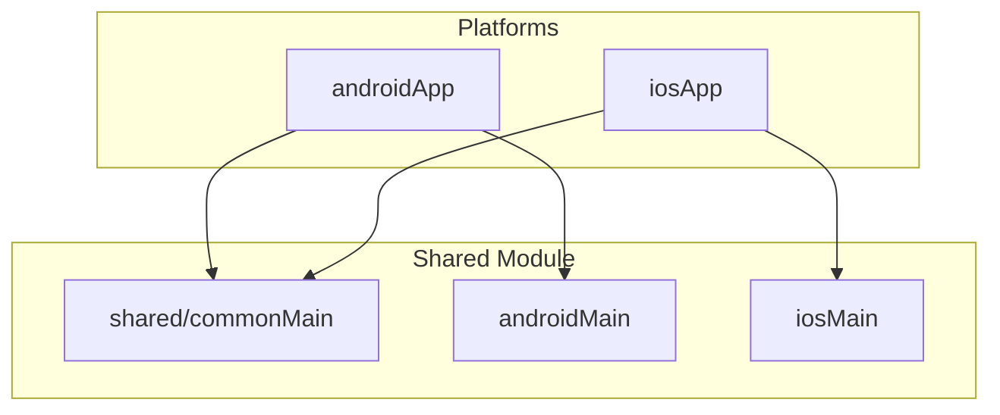

# Kotlin Multiplatform Template

[](https://kotlinlang.org)
[](https://www.jetbrains.com/lp/compose-multiplatform/)
[](LICENSE)

A production-ready Kotlin Multiplatform template for iOS and Android apps with Compose Multiplatform.

## Quick Start

### Option 1: Manual Setup

```bash
git clone https://github.com/nkrebs13/kmp-template.git my-app
cd my-app
./setup.sh
```

Follow the prompts to customize your project name and package.

**Available flags:**
- `--with-mcp` - Keep the MCP server directory for AI-assisted project management
- `--dry-run` - Preview changes without modifying files
- `--help` - Show help message

### Option 2: MCP Tool (AI-Assisted)

If you're using an MCP-compatible AI coding assistant, you can generate projects using the MCP tool:

1. Add the server to your AI assistant's MCP configuration:

   **Claude Code** (`.mcp.json`):
   ```json
   {
     "mcpServers": {
       "kmp-template": {
         "command": "node",
         "args": ["/path/to/template/mcp/index.js"]
       }
     }
   }
   ```

   **Cursor** (`.cursor/mcp.json`):
   ```json
   {
     "mcpServers": {
       "kmp-template": {
         "command": "node",
         "args": ["/path/to/template/mcp/index.js"]
       }
     }
   }
   ```

2. Ask your AI assistant to generate a project:
   ```
   Generate a new KMP project called "WeatherApp" with package "com.example.weather" in ~/Projects/WeatherApp
   ```

See [`mcp/README.md`](mcp/README.md) for detailed MCP tool documentation.

## Requirements

| Tool | Version | Notes |
|------|---------|-------|
| JDK | 17+ | Required for Gradle 9.x |
| Android Studio | Latest | With KMP plugin |
| Xcode | 15.0+ | macOS only, for iOS builds |
| macOS | 14.0+ (Sonoma) | Required for iOS development |
| Node.js | 18.0+ | Only if using MCP server |

### iOS Development Requirements

iOS builds require macOS with Xcode. The template targets:
- iOS 15.0+ deployment target
- Xcode 15.0+ (required for Swift 5.9+)
- Apple Silicon (arm64) or Intel (x64) simulators

## Generation Methods Comparison

| Feature | setup.sh | MCP Tool |
|---------|----------|----------|
| Interactive prompts | Yes | No (parameters) |
| Dry-run preview | Yes | No |
| Keep MCP directory | `--with-mcp` flag | Always removed |
| Post-generation validation | Automatic | Automatic |
| Git initialization | Automatic | Automatic |
| IDE integration | N/A | AI assistant |
| Reserved prefix validation | Yes | Yes |
| iOS bundle ID customization | Yes | Yes |

## Architecture



## Project Structure

```
template/
├── androidApp/          # Android application module
├── iosApp/              # iOS Xcode project
├── shared/              # KMP shared code
│   ├── commonMain/      # Cross-platform code
│   ├── androidMain/     # Android-specific implementations
│   └── iosMain/         # iOS-specific implementations
├── baselineprofile/     # Android performance optimization
├── gradle/              # Build configuration & version catalog
├── mcp/                 # MCP server for AI-assisted generation
├── scripts/             # Utility scripts
│   └── validate.sh      # Template reference validation
├── docs/                # Documentation
└── setup.sh             # Template generation script
```

## Included Dependencies

| Category | Library | Version |
|----------|---------|---------|
| **Language** | Kotlin | 2.3.0 |
| **UI** | Compose Multiplatform | 1.10.0 |
| **Build** | Android Gradle Plugin | 9.0.0 |
| **Build** | Gradle | 9.3.0 |
| **Async** | Kotlinx Coroutines | 1.10.2 |
| **Serialization** | Kotlinx Serialization | 1.10.0 |
| **Code Quality** | Detekt | 1.23.8 |
| **Code Quality** | Spotless | 8.2.1 |

This template includes only essential dependencies to keep your project lean. The version catalog also includes entries for commonly-needed libraries that are not wired into module builds by default — add them to your module `dependencies {}` as needed. This includes Jetpack Compose Navigation (2.9.7), Kotlinx DateTime (0.6.2), and commented-out entries for Room, Ktor, Koin, and more (see [libs.versions.toml](gradle/libs.versions.toml)).

## Build Commands

```bash
# Android
./gradlew :androidApp:assembleDebug
./gradlew :androidApp:assembleRelease

# iOS Framework
./gradlew :shared:linkDebugFrameworkIosSimulatorArm64
./gradlew :shared:linkReleaseFrameworkIosArm64

# Testing
./gradlew :shared:allTests

# Code Quality
./gradlew spotlessApply    # Format code
./gradlew detekt           # Static analysis

# Validation (for template development)
./scripts/validate.sh      # Check for template references
```

## MCP Tool

The template includes an MCP (Model Context Protocol) server that enables AI coding assistants to generate and validate projects programmatically.

### Available Tools

| Tool | Description |
|------|-------------|
| `generate` | Create a new KMP project from the template |
| `validate` | Check a project for remaining template references |
| `list_dependencies` | List all template dependencies with versions |

### Setup

```bash
cd mcp
npm install
```

See [`mcp/README.md`](mcp/README.md) for complete documentation.

## Troubleshooting

### Android Build Fails

1. **Missing SDK**: Create `local.properties` with `sdk.dir=/path/to/android/sdk`
2. **JDK Version**: Ensure JDK 17+ is installed and `JAVA_HOME` is set
3. **Gradle Issues**: Try `./gradlew clean` then rebuild

### iOS Build Fails

1. **Xcode Not Found**: Install Xcode from the App Store
2. **Framework Missing**: Run `./gradlew :shared:linkDebugFrameworkIosSimulatorArm64`
3. **Signing Issues**: Open in Xcode and configure your development team

### Template References Found

If validation shows remaining template references:
1. Run `./scripts/validate.sh` to see specific locations
2. Manually replace any remaining `com.template` or `TemplateApp` references
3. Re-run validation to confirm

### MCP Tool Issues

1. **Node Version**: Requires Node.js 18+
2. **Dependencies**: Run `npm install` in the `mcp/` directory
3. **Permissions**: Ensure `mcp/index.js` is executable

## Contributing

Contributions are welcome! Please read our [Contributing Guide](CONTRIBUTING.md) and [Code of Conduct](CODE_OF_CONDUCT.md) before submitting a PR.

## License

This project is licensed under the MIT License - see the [LICENSE](LICENSE) file for details.

---

**Template Version:** 3.0.0 | **Kotlin:** 2.3.0 | **Compose:** 1.10.0 | **AGP:** 9.0.0 | **Gradle:** 9.3.0
