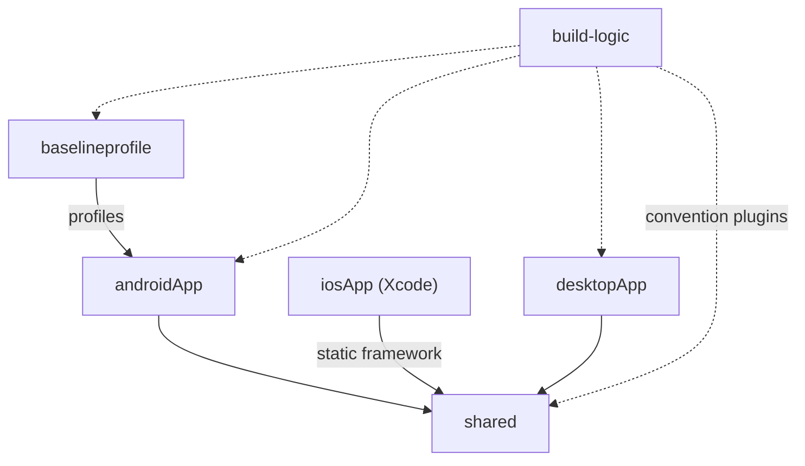

# Kotlin Multiplatform Template

A Kotlin Multiplatform starter for Android, iOS and desktop, with one Compose Multiplatform UI, a
strict build and an `AGENTS.md` that lets a coding agent generate, verify and extend the project.

[](https://github.com/nkrebs13/kmp-template/actions/workflows/ci.yml)
[](https://github.com/nkrebs13/kmp-template/releases)
[](LICENSE)
[](gradle/libs.versions.toml)
[](gradle/libs.versions.toml)
[](gradle/libs.versions.toml)


<sub>Android emulator and iOS simulator screenshots in drawn device frames; the desktop window
content is the real `App()` rendered off-screen, in a drawn window frame.</sub>

It is a skeleton, not a sample app: no DI, networking, navigation or architecture to delete. What
it gives you is the build, the checks, the CI, the generator and the agent guide.

**Not for:** native-UI iOS apps (SwiftUI first), or web/Wasm and server targets.

## Quick start

Prerequisites: any JDK to start Gradle (it provisions JDK 21 itself), plus git and perl for
`setup.sh`. iOS needs macOS on Apple Silicon with Xcode 16 or newer.

### With a coding agent

Give your agent a prompt like this:

```text
Create a new Kotlin Multiplatform app called WeatherApp (package com.acme.weather) from
https://github.com/nkrebs13/kmp-template: clone it into ./weather-app (not inside another
checkout), read AGENTS.md, and follow it.
```

The root [AGENTS.md](AGENTS.md) tells the agent how to pick the values, preview the change with
`./setup.sh … --yes --dry-run --json`, apply it, read the one JSON result, and then run
`./gradlew check` in the generated project, whose own `AGENTS.md` takes over from there.

### By hand

**Option A: "Use this template" on GitHub.** The first push to `main` of your new repository
generates the project; pushes to other branches don't. `template-cleanup.yml` derives the values
from the repository (`acme/weather-app` becomes `WeatherApp`, package
`io.github.acme.weather_app`) and commits the result. It then opens an issue with one `git rm` for
the template workflows GitHub won't let it delete. Details:
[docs/MAINTAINING.md](docs/MAINTAINING.md#use-this-template).

**Option B: clone and run `setup.sh`.**

```bash
git clone https://github.com/nkrebs13/kmp-template.git weather-app
cd weather-app
./setup.sh --name WeatherApp --package com.acme.weather --yes
./gradlew check
```

Add `--dry-run` to see every file it would change, `--no-desktop` for Android and iOS only, and
`--display-name`, `--bundle-id` or `--author` to override the defaults. `./setup.sh --help` lists
every flag and exit code. It validates everything before the first change and checks that no
template name is left before it starts the new git history.

## What you get

| Area | What is in the box |
|---|---|
| Platforms | Android, iOS and desktop (JVM) apps hosting one shared Compose Multiplatform `App()` |
| Build logic | `build-logic/` convention plugins; module build files hold only what is specific to them |
| Gradle | Configuration cache, and Isolated Projects (still incubating in Gradle) |
| Quality gate | `./gradlew check`: Kotlin compiler warnings as errors, Spotless/ktlint, detekt with Compose rules, Android lint with warnings as errors, Kover line coverage (minimum in [`KmpLibraryConventionPlugin.kt`](build-logic/convention/src/main/kotlin/convention/KmpLibraryConventionPlugin.kt)), and `checkForbiddenCalls` (no `println` in production code) |
| Tests | Compose UI tests of `App()` on the JVM and the iOS simulator, sharing one body; a test per platform `actual` |
| Android | A real baseline profile, generated on a Gradle Managed Device and packed into release builds; release signing from environment variables or `local.properties` |
| iOS | Settings in xcconfig files, never the pbxproj (deployment target in [`Config.xcconfig`](iosApp/Configuration/Config.xcconfig)); synchronized folders; a privacy manifest |
| Desktop | Compose Hot Reload, and Dmg/Msi/Deb packaging on JetBrains Runtime |
| CI | Linux for static analysis, Android and desktop; macOS for iOS tests and an `xcodebuild` of the app. Runs on PRs, on `main` and weekly; a separate job checks that every catalog coordinate still resolves |
| Generator | `setup.sh` with `--dry-run` and `--json`, tested by a plain-bash harness; every variant is generated and built in CI on Linux and macOS |
| Maintenance | Grouped Dependabot updates in every generated project; in this repository, auto-merge for non-major updates and one-command releases |

## Compared with the JetBrains wizard

The [Kotlin Multiplatform wizard](https://kmp.jetbrains.com) is the right place to start for web
or server targets, native iOS UI, or a non-Gradle build. This template uses the same module layout
and adds the tooling around it.

| | KMP wizard | This template |
|---|---|---|
| Targets | Android, iOS, desktop, web, server | Android, iOS, desktop |
| iOS UI | Compose Multiplatform or native | Compose Multiplatform |
| Module layout | `shared` plus an app module per platform | The same |
| Build configuration | A build script per module | Convention plugins in `build-logic/` |
| Tests | With "Include tests": one placeholder test (`assertEquals(3, 1 + 2)`) per platform source set | A Compose UI test of `App()` on the JVM and iOS, a test per platform `actual`, and a coverage minimum in `check` |
| iOS settings | `Config.xcconfig`: team, bundle ID, versions | The same, plus Debug/Release/Local xcconfigs, a privacy manifest and an `xcodebuild` in CI |
| Formatting and static analysis | Not generated | Spotless/ktlint, detekt, lint and compiler warnings as errors, all in `check` |
| CI and dependency updates | Not generated | GitHub Actions on Linux and macOS, Dependabot |
| Android startup | Not generated | Baseline profile on a managed device |
| Naming the project | A web or IDE form | `setup.sh` flags with JSON output, or automatic on "Use this template" |
| Agent guidance | Not generated | `AGENTS.md` written for agents |

Wizard column: the generated projects JetBrains publishes in
[Kotlin/kmp-wizard](https://github.com/Kotlin/kmp-wizard) (one branch per option set, updated
2026-10-27), checked October 2026.

## Why it's built this way

| Decision | Reason |
|---|---|
| A skeleton, not a sample app | Every library and screen a user has to delete is friction. |
| `shared` plus per-platform app modules | It is the current JetBrains wizard layout, and AGP 9 no longer allows the Android application plugin in a KMP module. |
| A static framework through `embedAndSignAppleFrameworkForXcode` | Xcode builds it through Gradle with no CocoaPods or SPM setup; [Swift export](https://kotlinlang.org/docs/native-swift-export.html) is still Alpha. |
| JDK 21 toolchain, Java 17 bytecode | Builds run on a current LTS JDK that Gradle downloads itself, while the output still runs on Java 17. |
| Live optional catalog entries | Optional libraries are real, unreferenced entries that `verifyCatalog` checks still resolve, so enabling one is a one-line change that works. |
| `AGENTS.md` in every generated project, not tool-specific files | One tool-neutral guide for every agent; `CLAUDE.md` only imports it. |

## Module graph


```mermaid
graph TD
    androidApp --> shared
    iosApp["iosApp (Xcode)"] -->|static framework| shared
    desktopApp --> shared
    baselineprofile -->|profiles| androidApp
    buildLogic["build-logic"] -.->|convention plugins| shared
    buildLogic -.-> androidApp
    buildLogic -.-> desktopApp
    buildLogic -.-> baselineprofile
```

## Commands and layout

In a generated project:

```bash
./gradlew spotlessApply       # format
./gradlew check               # the quality gate
./gradlew :androidApp:installDebug
./gradlew :desktopApp:run     # or :desktopApp:hotRun --auto
open iosApp/iosApp.xcodeproj  # or xcodebuild, see AGENTS.md
```

| Path | Contents |
|---|---|
| `shared/` | The KMP library: UI, logic, resources and tests |
| `androidApp/`, `iosApp/`, `desktopApp/` | Thin platform apps |
| `baselineprofile/` | The Android baseline profile producer |
| `build-logic/` | Convention plugins |
| `config/` | detekt and Compose stability configuration |
| `gradle/libs.versions.toml` | Every version, plus the optional libraries |

The generated project's `AGENTS.md` ([source](.template/project/AGENTS.md)) covers every command,
where each setting lives, recipes and the definition of done.

## Maintaining and contributing

- [docs/MAINTAINING.md](docs/MAINTAINING.md): how the generator works, releases, Dependabot,
  repository settings and the decisions not to undo.
- [CONTRIBUTING.md](CONTRIBUTING.md) and the [Code of Conduct](CODE_OF_CONDUCT.md).
- [CHANGELOG.md](CHANGELOG.md) and [releases](https://github.com/nkrebs13/kmp-template/releases).
- [MIT License](LICENSE).
